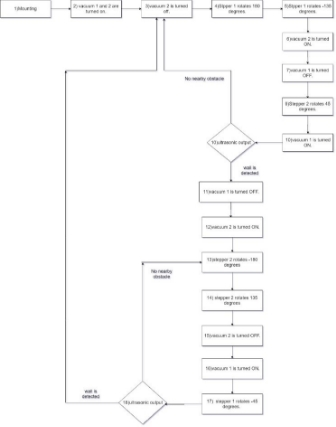

### Fidget Cleaner

### Abstract

Ceiling cleaning has always been a tedious job. The health of the cleaning staff is compromised and over a long time, it may lead to serious health issues. The efficiency for the same is also very questionable as it is not really possible for the workers to clean frequently and with the same efficiency. Cleaning the ceilings regularly, manually is also not very practical and there are no services that provide a solution to this issue. In this paper, the design, analysis, and development of a ceiling cleaner used for cleaning high elevated ceilings using suction mechanism on each arm to hold on to the ceiling and semicircular motion for cleaning is presented.

https://user-images.githubusercontent.com/66246207/159147635-f4a1877a-46d1-4612-8ec2-bac9d98dd4e4.mp4

<!-- TABLE OF CONTENTS -->

  
Table of Contents

  <ol>
    <li>
      <a href="#Introduction">INTRODUCTION</a>
    </li>
    <li>
      <a href="#video">VIDEO PRESENTATION</a>
    </li>
    <li>
      <a href="#SYSTEM" >SYSTEM OVERVIEW</a>
    </li>
<li>
      <a href="#FLOWCHART">FLOWCHART</a>
    </li>
    <li>
      <a href="#SYSTEM">SYSTEM STRUCTURE</a>
    </li>
    <li><a href="#MARKET">MARKET RESEARCH / LITERATURE SURVEY</a></li>
    <li><a href="#CONCLUSION">CONCLUSION AND FUTURE SCOPE</a></li>
  </ol>

<!-- Introduction -->

### INTRODUCTION

We have witnessed a variety of vacuum cleaners from handheld vacuum to robotic vacuum used for cleaning floors and windows but for autonomous cleaning of ceilings. Ceil- ings are still cleaned in the traditional ways using long mop. At high elevated places like in a mall or an industry its more tedious and risky. We have designed a cleaning device addressing the same. Fidget cleaner is a smart cleaning device designed with the main intention of cleaning ceiling autonomously and reducing the tediousness and risk. It also increases the efficiency and frequency.

### VIDEO PRESENTATION

https://user-images.githubusercontent.com/66246207/159147865-bc92e50c-74c3-4ca1-9069-0518c82a9c02.mp4

<!-- SYSTEM -->
### SYSTEM OVERVIEW

Fig. 1. Fidget Cleaner

Fidget Cleaner consist of 2 arms. These arms consist of suction mechanism created using vacuum pump. On mounting this device on ceiling the Arm 1 and 2 vacuum will be turned ON. Vacuum 2 voltage will be reduced and steeper motor 1 starts its rotation. Arm 2 will start moving and cleaning the area around 180 degree. After rotating 180 degree the rotation is reversed and it rotates negative 135 degree. Now Arm 2 vacuum will be turned ON and Vacuum 1 voltage will be reduced and stepper motor 2 will rotate 45 degree and Arm 2 will be parallel to arm 1 at this stage. This procedure is repeated till the ultrasonic sensor detects an obstacle. On detection of an obstacle, the cleaner will use the same algorithm to move sideways by 180 degrees. And the exact opposite procedure begins. This will help cleaning the ceiling upside down in 2 dimensional aspects.
<!-- FLOWCHART -->
### FLOWCHART

Fig. 2. Flowchart
<!-- SYSTEM -->
### SYSTEM STRUCTURE
###Hardware

Hardware used is divided into three major tasks, Cleaning, Movement and Suction Mechanism. Cleaning and Movement

mechanism includes servo motor and non-technical hard- ware. Suction Mechanism includes vacuum pump and non- technical hardware.

1) Cleaning and Movement mechanism
- Servo Motors (MG995) : Due to the high torque and metal gears, these motors are used for the semicircular motion used for cleaning and also is used for movement of the device.
- Sponge and Cleaning Threads are the non- technical hardware used for cleaning.
2) Suction Mechanism
- Vacuum Pump : Vacuum pump are used for creat- ing the appropriate vacuum required for the device to hold on to the ceiling during the cleaning process.
- Bellows Suction Cups are the non-technical hard- ware used for suction mechanism.
### Software

The major software task is to process the inputs given by the user through the Blynk application or through the readings of ultrasonic sensors and behave accordingly. The processor used is NodeMCU (ESP8266) and its interface is Arduino IDLE. Blynk application is also developed as an GUI for user communication with the device and is connected to NodeMCU (ESP8266)
<!-- MARKET -->
### MARKET RESEARCH / LITERATURE SURVEY

Fidget Cleaner has huge great market available already. Although being a huge market Fidget Cleaner has a minimal competition as no such technology has been introduced in the market yet. The available solutions to the problem statement stated above are a high labour required, less efficient and also average health affecting solutions. As there being no great competition, the growth of Fidget Cleaner is expected to reach heights as it effects the efficiency and the average health of the workers working there. Fidget Cleaner would target a specific class of people like the workers working in a high elevated ceiling places or companies offering cleaning solutions or services to others. Fidget Cleaner have a high market profitability as then competition is less and demand as comparatively is high. It can also have a profitable margin up to at least 30%, as it involves new technology to the tradi- tional way of cleaning and also increases the efficiency and also doesn’t effect the health of the workers in the long run.
<!-- CONCLUSION -->
### CONCLUSION AND FUTURE SCOPE

As per the current market scenario there is no such automated product available that could clean the ceilings. Traditional method of mob cleaning is used for the same. Fidget cleaner using suction mechanism cleans the ceiling. The suction mechanism helps the fidget cleaner to hold on to the ceiling. With changing the voltage And help of the steeper motors the product traverses the entire ceiling and cleans the inaccessible corners with great ease and efficiency. This product will be a table turner in the market and with slight changes it will be able to clean the ceilings as well as the floor. To further enhance the cleaning mechanism we can exper- iment with various different technologies. Cleaner brushes can be improved for better efficiency. The size of the prototype can be compacted with the help of stronger but lighter suction motors. To further improve it’s performance obstacle detection sensors can be embeded on the prototype.
<!-- Introduction -->
### ACKNOWLEDGMENT

We would like to thank A.P. Shah Institute of Tech- nology, Thane for providing us with the space and other resources to successfully complete this project. We also thank Prof. Kaushiki Upadhyaya, Prof. Selvin Futardo, Prof Kiran Despande for their guidance.
<!-- Introduction -->
### REFERENCES

1. Yu Yoshida, Shugen Ma, “Design of a Wall-Climbing Robot with Passive Suction Cups” in Proceedings of the 2010 IEEE International Conference on Robotics and Biomimetics December 14-18, 2010, Tianjin, China
1. Tsutomu Takeshita, Tetsuo Tomizawa and Akihisa Ohya, “ A House Cleaning Robot System -Path indication and Position estimation using ceiling camera” in SICE-ICASE International Joint Conference 2006 Oct. 18-21, 2006 in Bexco, Busan, Korea.
1. Iwan Ulrich , Francesco Mondada , J.-D. Nicoud “Autonomous vacuum cleaner” in Proceedings of the 2010 IEEE International Conference on Robotics and Biomimetics December 14-18, 2010, Tianjin, China
1. B. Smith, “An approach to graphs of linear forms (Unpublished work style),” unpublished.
1. Kathryn A. Daltorio, Andrew D. Horchler, Stanislav Gorb, Roy E. Ritzmann, and Roger D. Quinn1r, “A Small Wall-Walking Robot with Compliant, Adhesive Feet,”

